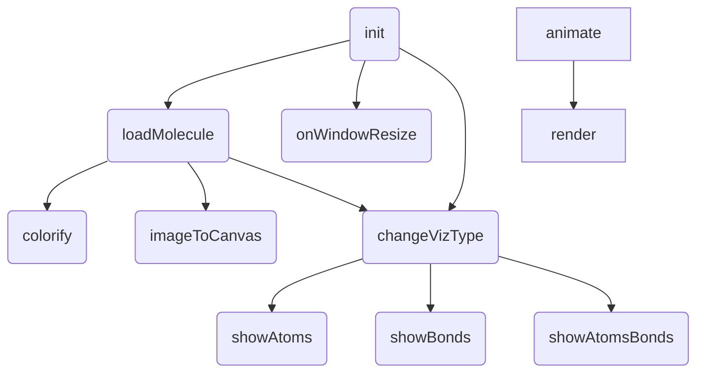

---
title: threejs API学习 Ⅳ
tags:
 - WebGL
 - 3DGIS
categories:
 - 3DGIS
comments: true
date: 2024-01-07 15:56:05
photos: https://wallroom.io/img/3840x2160/bg-81f2d39.jpg
cover: https://wallroom.io/img/3840x2160/bg-81f2d39.jpg
---
# 学习资源

[AxesHelper – three.js docs (threejs.org)](https://threejs.org/docs/#api/zh/helpers/AxesHelper)

[1. threejs文件包下载和目录简介 | Three.js中文网 (webgl3d.cn)](http://www.webgl3d.cn/pages/aac9ab/)

[Releases · mrdoob/three.js (github.com)](https://github.com/mrdoob/three.js/releases)

[系统课—面向人群_哔哩哔哩_bilibili](https://www.bilibili.com/video/BV14r4y1G7h4/?p=2&spm_id_from=pageDriver&vd_source=5270415d668b21206238403450bb29b5)


# 场景标注标签

## CSS2DRender

### CSS2DObject

可以把HTML元素转换为类似threejs网格模型的对象，然后设置其位置；

HTML标签摆放

> 获取html元素➡️new CSS2DObject➡️.position.set()➡️scene.add()

### CSS2DRenderer

> new CSS2DRenderer()➡️css2dRender.render()➡️.setSize(), .domElement
>
> 会在CSS2DObject的外面构建一个div元素，这个就是设置的CSS2DRenderer

对CSS2DRenderer的设置，就可以参考canvas在网页中的布局设置，如(style.position, style.top, style.marginTop, style.top)

这个是标签对应的Canvas，和threejs物体的Canvas的位置之间需要保持统一

为了避免这层Canvas影响threejs物体Canvas的交互事件，需 `css2Renderer.domElement.style.pointerEvents='none';`

如果出现threejs物体Canvas挡住了标签Canvas，也可以强制设置z-index：`renderer.domElement.style.zIndex=-1; css2dRenderer.domElement.style.zIndex=1;`

此外，css2dRenderer也和物体所在的Canvas一样，在窗口尺寸变化的时候需要重新设置；

模型和模型父对象对标签位置设置的影响：

> 可以通过.getWorldPosition()，一层层打组放置:
>
> 1. mesh.position, meshGroup.position 后者改变了前者的全局位置
> 2. mesh.getWorldPosition(worldPosition), tag.position.copy(worldPosition) 把全局位置更新给标签
> 3. group, group.add(meshGroup, tag); 把这两个放到一个组里
>
> 也可以更方便的把标签作为Mesh的子对象:
>
> 1. mesh.add(tag)
>
> 在模型上放置标签，需要注意模型对象本身的局部坐标系，坐标原点在哪里，add上去的tag默认是在mesh局部坐标系的原点（可以通过AxesHelper来可视化模型的局部坐标系
>
> * 快捷方法：直接在建模软件里，创建用于标注的空对象obj，设置好位置。然后直接obj.add(tag)

标签指示线或箭头：

> 设置tag的HTML标签，包括了指示线；
>
> 在threejs部分设置位置；
>
> html部分将这个tag，设置style="display: none;"，而当模型加载完成后，CSS2DRenderer默认会渲染成display: block

💻点击物体，呈现选中描边状态，并弹出标签；

💻单机按钮关闭HTML标签；

> 如果前面已经设置了CSS2DRenderer的pointerEvents为none，可以考虑把标签的子元素设置pointerEvents为auto，这样关闭事件就不会影响threejs物体画布的事件，且还能正常关闭

## CSS3DRender

CSS3DRender相对CSS2DRender来说，渲染的标签，会跟着相机进行同步缩放，而CSS2的渲染标签默认保持自身像素值。

其他使用方法和css2drenderer类似；

同理对于CSS3DObject，需要区别注意的地方：

1. 禁止CSS3DObject标签对应HTML背面显示：（次序问题：document.getElementById()➡️new CSS3DObject(div)➡️div.style.pointerEvents='none';

`<div id = "tag" style = "backface-visibility: hidden;">label content</div>`

2. 3d的标签的大小会受到css设置的影响，且大小的像素可以对应到渲染元素的大小，可以在threejs里进行缩放来调节,tag.scale.set(0.5,0.5,1);
3. 3d标签的偏移，还可以通过threejs模型修改的方式进行，如tag.position.y+=10;

CSS3DSprite

> 渲染效果类似Sprite, 而CSS3DObject渲染效果类似于Mesh
>
> 区别就是可以跟着场景旋转缩放，但自身的姿态角度始终平行于画布

💻 CSS3批量标注多个标签

💻 Sprite作为标签来进行场景标注：精灵模型渲染 `Sprite`的标签，默认可以被其他网格模型 **遮挡** ，但是CSS3渲染器渲染的HTML元素标签是叠加在canvas画布上，不会被其它网格模型遮挡

如果要实现标签随文本自定义变化，可以使用Canvas画布来进行绘制；

> 可以找别人封装好的函数，然后修改参数进行调用。

# 关键帧动画

## 关键帧动画AnimationClip使用流

1. 给需要添加动画的模型一个name, model.name="box"，以供后续调用它的属性和方法
2. 设置关键帧的数据new THREE.KeyframeTrack(属性，时间点数组，变化值数组)
3. 创建clip关键帧动画对象 new THREE.AnimationClip(名称，持续时间，关键帧数据数组)
4. 动画播放const mixer = new THREE.AnimationMixer(模型)，此外可以监听到mixer的finished属性、
5. 控制播放，mixer.clipAction,返回动画动作对象AnimationAction
   1. .play()
   2. .loop, THREE.loopOnce,
   3. .clampWhenFinished
   4. .stop()
   5. .reset()
   6. .paused
   7. .timeScale
   8. .duration，THREE.AnimationClip的第二个参数
   9. 控制动画播放的片段，开始.time, 结束.duration ➡️ 需要.loop=THREE.LoopOnce，和 .clampWhenFinished=true，来保证能完全起作用
   10. 查看任意时间动画状态 .paused=true, 设置.time，即可查看特定状态下的动画，也可以通过GUI来拖动查看任意状态的动画 `gui.add(clipAction,'time',0,6).step(0.1)`
6. 更新播放器时间, mixer.update()

💻 拖动条和播放按钮结合gui.add().step().name().onChange(function() { })

## 变形动画

设置变形顶点：geometry.morphAttributes.position=[];

new THREE.Mesh()

设置形变程度：mesh.morphTargetInfulences[i]

生成变形动画：THREE.KeyframeTrack(), THREE.AnimationClip()

💻 通过导入外部Blender，来控制人体形态 ➡️ 可以通过GUI来控制

## 骨骼动画

Bone, 父类是Object3D, 使用也类似于Geometry

.position, .rotateX, .add(),

骨骼关节可视化：new THREE.SkeletonHelper()

> Bone1→Group.add()→skeletonHelper→Group.add()

也可以通过GUI来控制；

SkinnedMesh骨骼网格模型，类似于Mesh

> skinnedMesh.skeleton, 获取到骨架，mesh是跟着骨架来动
>
> skinnedMesh.skeleton.bones, 获取到骨架里的关节

💻 骨骼动画的切换

> button, .play(), .stop() 点击按钮触发
>
> AniAction.weight可以控制动画权重

## 解析外部模型动画

加载的gltf模型，通过gltf.animations可以直接获取到动画属性/变形动画属性：如果没有帧动画数据，就是一个空数组，有帧动画数据的情况下，里面可能1个或多个Clip动画对象 `AnimationClip`

# tweenjs动画

npm安装：`npm i @tweenjs/tween.js@^18`

导入： `import THWEEN from '@tweenjs/tween.js';`

基本使用：

```js
const tween = new TWEEN.Tween();   // mesh.position, mesh.scale，大小和缩放
tween.to(); // 可以直接x:, y:
tween.start();


function loop() {
	TWEEN.Update();
	requestAnimationFrame(loop);
}
loop();

function render() {
	TWEEN.update();
	renderer.render(scene, camera);
	requestAnimationFrame(render);
}
render();

```

相机动画：

> 初始化：camear.position.set(), camera.lookAt()
>
> 动画：new TWEEN.Tween(camear.position).to().onUpdate(function(obj) { camera.lookAt() } ).start()
>
> (obj就对应的是Tween里面的参数)
>
> 缓动：.easing(TWEEN.Easing.缓动函数.缓动类型)

TWEEN回调：

> OnStart()
>
> OnUpdate()
>
> OnComplete()

💻 点击后相机靠近观察设备

> 可以使用空物体作为相机靠近设备的具体位置
>
> 需要注意OrbitControls对Camera.position的影响

💻 控制模型淡入淡出

> 通过TWEEN.Tween({opacity: material.opacity}), material.transparent

# 官方案例

## 需求列举

| 例子名称              | 功能                                                                                                      | 知识点                                                                                                                                                                                     |
| --------------------- | --------------------------------------------------------------------------------------------------------- | ------------------------------------------------------------------------------------------------------------------------------------------------------------------------------------------ |
| css2d_label           | 构建几何体，加载贴图，模型旋转；``设置模型的显隐；``添加辅助Helper；``添加2D标签；                        | import: OrbitControl, CSS2DRenderer, CSS2DObject, GUI``THREE: Clock, TextureLoader, PerspectiveCamera, Scene, DirectionLight, AxesHelper, SphereGeometry, MeshPhongMaterial, WebGLRenderer |
| css3d_molecules       | 加载PDB模型并拆分;``构建atoms的Sprite;``窗口大小自适应变化；``交互展示atoms和bonds;                       | import: TrackballControls, PDBLoader, CSS3DRenderer, CSS3DObject, CSS3DSprite, GUI``THREE: PerspectiveCamera, Scene, Object3D,                                                             |
| css3d_orthographic    | 一个是对几何体的渲染，一个是对CSS下的div的渲染；``对OrbitControls的使用中，面板的设置和范围的考量很重要。 | import: OrbitControls, CSS3DRenderer, CSS3DObject, GUI``THREE: OrthographicCamera, Scene, WebGLRenderer, CSS3DRenderer, OrbitControls,                                                     |
| ⭐css3d_periodictable | 效果很好看，而且有故事性；``里面的实现比较数学，需要你认真看；``此外，里面用到了DoTween动画，可见相通性。 | import:  TWEEN, TrackballControls, CSS3DRenderer, CSS3DObject``THREE: PerspectiveCamera, Scene,                                                                                            |
| css3d_sandbox         |                                                                                                           |                                                                                                                                                                                            |
|                       |                                                                                                           |                                                                                                                                                                                            |
|                       |                                                                                                           |                                                                                                                                                                                            |

css3d_molecules 函数调用：


