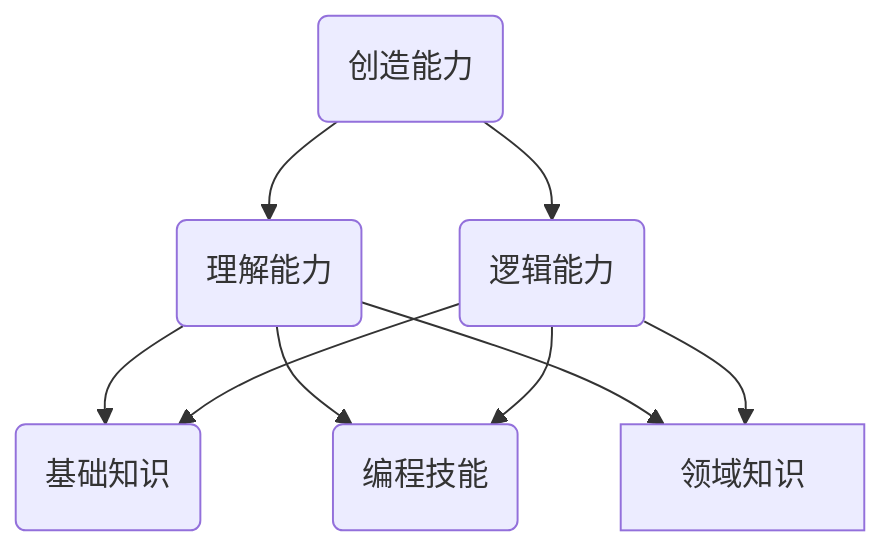

# 参考资源

https://zhuangbiaowei.gitbook.io/learn-with-open-source/
https://boholder.github.io/blogs/learn-from-source-code/

# 笔记

## 如何选择开源项目

一个领域的能力体系：

> 基础知识：包括计算机、数学、算法、逻辑等，通过学习书本教材；
>
> 编程技能：学习具体的语言；
>
> 领域知识：和工作方向有关，如企业级应用的开发，需要了解管理制度、财务、成本、仓储等知识；

提高代码质量的书推荐：

> Clean Code
>
> Design Patterns: Elements of Reusable Object-Oriented Software
>
> Clean Architecture: A Craftsman's Guide to Software Structure and Design
>
> How to Read a Book: The Classic Guide to Intelligent Reading
>
> Head First设计模式

寻找开源项目，可以查看该语言对应的Awesome List；

选择和自身当前的编程技能和知识水平相当的项目；

先读相对较小的项目，接着读更大的项目；

如果目前不能理解某些特定的代码片段，意味着存在知识缺口（Knowledge Gap），可以试着读一些相关的书、论文或其他文档，更有信心的时候再回来接着读代码；

一个模式：读（代码、书、论文），写，更多的读，更多的写。

## 理解源代码

> 寻找文档,熟悉功能,先玩一遍；
>
> 静态理解项目：目录结构、包名和文件名、类名函数名和变量名、注释和Readme、UML图、外部文档
>
> 动态理解项目：输出日志、设置断点和单步跟踪、抛出异常、修改和破坏性尝试
>
> 主线和支线：寻找入口、跟踪关键流程、寻找挂接点
>
> 外围代码：必须存在的外围功能、demo和Example、单元测试

UML的使用：

> UML系统开发中的三个重要模型：
>
> * 功能模型（从用户角度，展示系统的功能，包括用例图
> * 对象模型（采用对象、属性、操作、关联登，展示系统的结构和基础，包括类图
> * 动态模型（展示系统内部的行为，包括序列图、活动图、状态图
>
> 建议：
>
> * 先建立对象的静态模型（画类图）
> * 在UML规范之外可以添加一些辅助自己记忆的符号
> * 其次，在动态理解的过程中，可以对关键的执行路径画出时序图
> * 对于非面向对象的项目，可以参照类图和组件图的模式，画出模块图

日志(log, logger, logging)：

> 通过修改源代码，增加更多的日志输出，帮助理解；
>
> 多线程程序输出的日志，会存在输出内容次序不一致的问题，需小心；

异常：

> 多种语言都支持异常处理和手动抛出异常；
>
> 在特定的位置，把整个调用序列打印出来，可以快速找到整个项目从何处开始，如何一层层调用，最终到达设置抛出异常的位置；

单元测试：

> 软件开发中最具有其他性的是“测试驱动开发（TDD）”，最易误导开发者的是“设计模式（DP）”；
>
> 完整而全面的单元测试代码，说明代码的质量也不赖；
>
> 好的单元测试，会测试关键逻辑与核心算法，差的单元测试会侧get/set这种无关紧要代码；
>
> 先对项目有所了解后，阅读单元测试，以防现实琐碎细节而迷失方向；

设计模式：

> 具备一定的编程语言与设计模式的知识和经验，有助于阅读大项目；
>
> 了解有关源码组织和编程范式的最佳实践；

开源软件的"知其所以然"

> * 架构决策：理解项目为什么像这样的做架构设计
> * 代码风格
> * 领域知识
> * 编程技巧
>
> 如何搞清楚这些所以然：
>
> * 如果我来做一个，如何做？
> * 如果对这个项目做减法，可以去掉哪些模块和代码？真的可以去掉吗？
> * 通过阅读单元测试，理解开发者的设计思路
> * 做一些破坏或修改，来理解项目中的那些做法
> * 可以通过思考后，在开源社区发起讨论、向作者提问，阅读一些文档和书籍；

为开源项目做共享

> 提Bug和建议；
>
> 帮助完善开发文档；
>
> 提交代码（功能代码和测试代码）；
>
> 周边代码（demo/扩展/子项目）；
>
> 外部宣传；
>
> 写一篇代码点评，记录代码中好的和不好的部分，以及学到的内容；

编辑器的选择：

> 熟练使用的，拥有快速检索关键字和变量名的能力；
>
> 熟练查找函数的引用和定义；
>
> 试着学习仅使用键盘操作编辑器；
